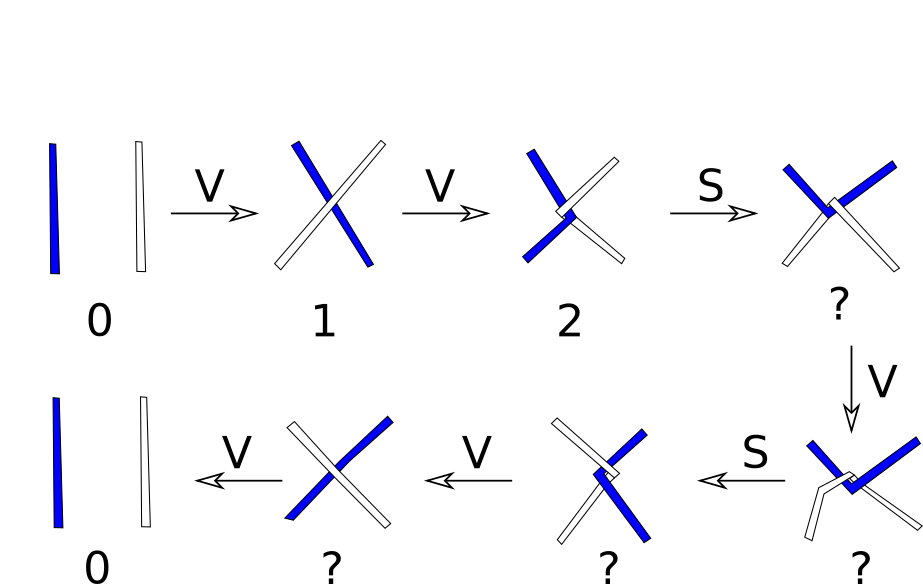

Hnútar sem almenn brot
======================

Prófum að taka annað dæmi. 

Notið tilgáturnar ykkar um hvað S gerir til að reyna að finna út hvaða tölur svara til hnútanna hér að ofan.   
   
.. begin-toggle:: :label: Lausn

Tilgáta: S breytir tölunni í mínus einn á móti tölunni. Þá verður myndin svona og allt gengur upp.

.. image:: ./uppgotvun2.png
   :width: 75%
   :align: center

.. end-toggle::   

.. begin-toggle:: :label: Reglur um V og S

Táknum töluna sem hnúturinn svarar til með óþekktri stærð :math:`x`.

- Ef við notum V þá breytist hnúturinn :math:`x` í :math:`x+1`.

- Ef við notum S þá breytist hnúturinn :math:`x` í :math:`-\frac{1}{x}`.

Með þessum reglum getum við búið til alls konar almenn brot með því að binda hnúta. Stóra spurningin er núna hvort við getum alltaf leyst hnútinn aftur.

.. end-toggle::   
